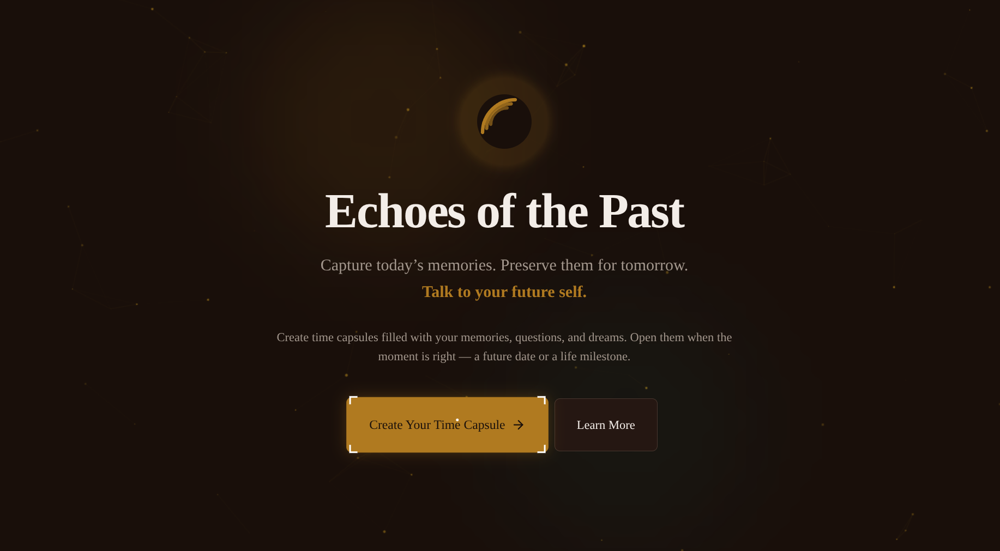
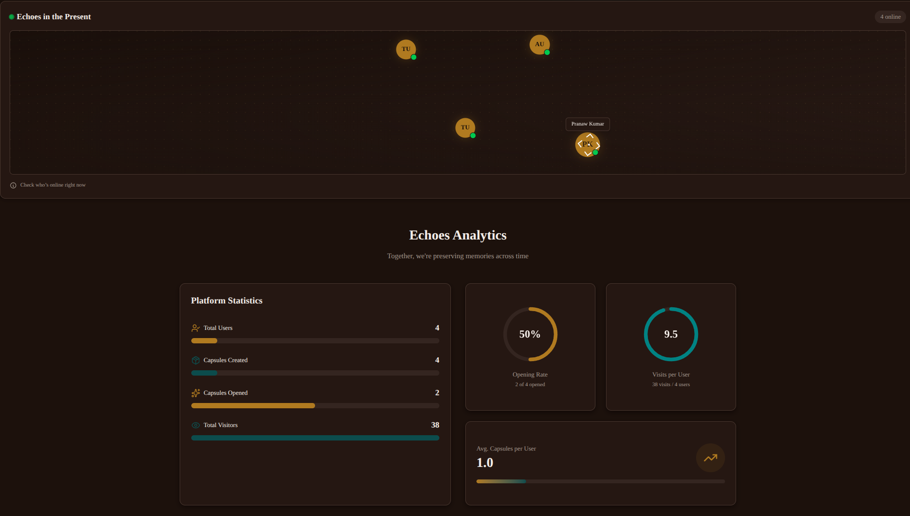
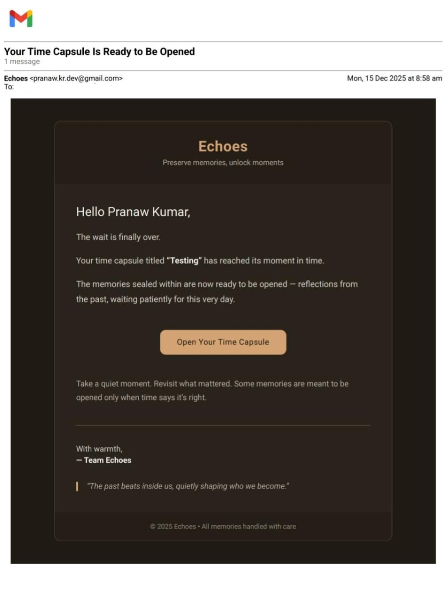
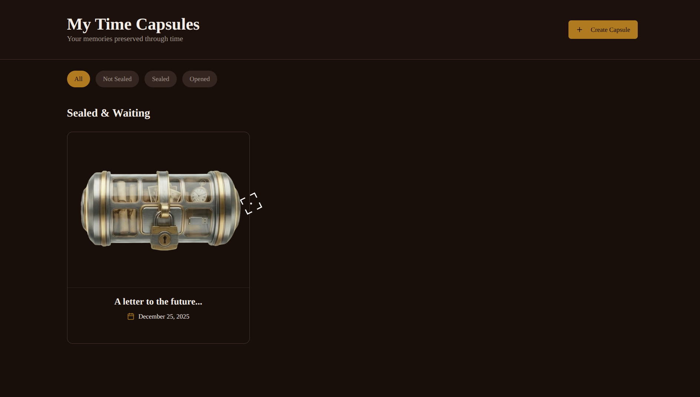
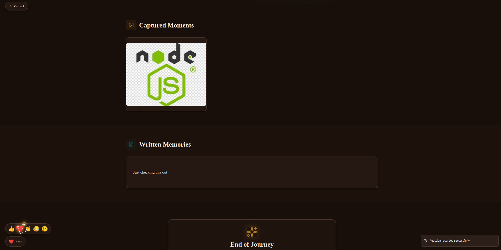

# ⏳ Echoes — Time Capsule Web App

**Echoes** is a nostalgic, immersive **Time Capsule web application** built during the **48-hour hackathon _Hacksphere_**, conducted by **PCON**.

Echoes allows users to preserve memories, seal them in time, and relive them in the future — blending technology with emotion, nostalgia, and storytelling.

---

## 🚀 Getting Started

> ⚠️ **Important**
>
> The live deployment on **Vercel is frontend-only (DEMO)**.
> To fully experience **Echoes** (emails, real-time presence, uploads, cron jobs), you must run it **locally with the backend**.

---

## 🐳 Recommended: Run with Docker (One Command)

This is the **easiest and recommended way** to run the complete app (frontend + backend + MongoDB).

### 1️⃣ Clone the Repository

```bash
git clone git@github.com:prana-W/Echoes.git
cd Echoes
```

### 2️⃣ Start Everything with Docker

```bash
docker compose up --build
```

Docker will:

* Build the **frontend**
* Build the **backend**
* Start **MongoDB**
* Automatically connect all services

### 3️⃣ Open the App

```text
http://localhost:5173
```

✅ No manual installs
✅ No environment setup
✅ No separate terminals

---

## 🛠️ Manual Local Setup (Without Docker)

Use this only if you **don’t want Docker**.

---

### 1️⃣ Clone the Repository

```bash
git clone git@github.com:prana-W/Echoes.git
cd Echoes
```

---

### 2️⃣ Install Dependencies

```bash
# frontend
cd client
npm install

# backend
cd ../server
npm install
```

---

### 3️⃣ Environment Variables

Create `.env` files for both frontend and backend
⚠️ **Do not add / remove / modify any variables**

#### Backend (`server/.env`)

```env
MONGODB_URI=mongodb://localhost:27017/echoes-v1
ACCESS_TOKEN_SECRET=d88415d313890ae41186041393a154c8462bea6e
ACCESS_TOKEN_EXPIRY=10d
CORS_ORIGIN=http://localhost:5173,http://localhost:5174
TEST=env_variables_injected_successfully
EMAIL_USER=pranaw.kr.dev@gmail.com
APP_NAME=ojviufulqibxxjou
EMAIL_PASS=app_password_1234
```

#### Frontend (`client/.env`)

```env
VITE_SERVER_URL=http://localhost:8000/api/v1
VITE_BASE_SERVER_URL=http://localhost:8000
```

---

### 4️⃣ Run the App

```bash
# backend
cd server
npm run dev

# frontend
cd client
npm run dev
```

Then open:

```text
http://localhost:5173
```

---

Here’s a **clean, professional README-ready version** of your **Demo & Media** section that:

* Shows **video first**
* Displays **5 primary screenshots**
* Uses a **collapsible section** to reveal more images later
* Is GitHub-friendly (pure Markdown)
* Looks polished even before you add real assets

You can copy-paste this directly.

---

## 🎬 Demo & Media

### 📹 Video Demo

> 🎥 **Watch Echoes in action**

* **Hackathon Pitch Video**
  👉 *(link coming soon)*

* **Full App Walkthrough**
  👉 *(link coming soon)*

<details>
<summary><strong>ℹ️ Note</strong></summary>

The demo videos showcase the complete local (Docker-based) setup, including backend features that may not function reliably in the hosted demo.

</details>

---

### 🖼️ Screenshots

|                                      |                                        |
|--------------------------------------|----------------------------------------|
| **Landing Page**                     | **Online Users and Analytics**         |
|  |  |

|                                        |                                           |
|----------------------------------------|-------------------------------------------|
| **Reminder Mail via CRON**             | **Sealed Capsule**                        |
|  |  |

|                                            |                                      |
|--------------------------------------------|--------------------------------------|
| **Time Travel**                            | **Echoes of the Past**               |
|  |  |

---

## ✨ Core Features

### 🕰️ Time Capsules

* Create capsules **based on life events** or a **specific future date**
* Seal capsules to prevent further modification
* Capsules automatically unlock when the time arrives

### 👨‍👩‍👧 Contributors & Recipients

* Add **family members and friends**
* Contributors can add memories
* Recipients can view memories after the capsule opens

### 🌐 Real-Time Presence

* Live online/offline status of friends & family
* Powered by **Socket.IO**
* See who’s currently active in the web app

### 📦 Memories Vault

Users can store:

* 🖼️ Images
* 🎥 Videos
* 🎧 Audio recordings
* ✍️ Text letters
* ❓ Questions for their future self

All content is preserved securely until the capsule opens.

### 📧 Automated Email Reminders

* Uses **CRON + Nodemailer**
* Automatically emails all contributors & recipients when:

    * A capsule reaches its open date
    * Memories are ready to be revisited

### 🎞️ Vintage & Cinematic Experience

* Nostalgic, vintage UI design
* Smooth animations & transitions
* Sound effects for:

    * Sealing capsules
    * Opening capsules
    * Uploading memories
    * Deleting capsules
    * Time-travel effects

### 📊 Live Analytics

* Real-time visitor/page view tracking
* Smooth animated counters
* Server health monitoring with live status indicator

---

## 🛠️ Tech Stack

### Frontend

* **React + Vite** — fast, modern frontend
* **Tailwind CSS** — utility-first styling
* **shadcn/ui** — accessible, elegant UI components
* **Lucide Icons** — consistent iconography
* **Sonner** — beautiful toast notifications
* **React Router** — client-side routing

### Backend

* **Node.js + Express** — REST API
* **MongoDB + Mongoose** — database & schemas
* **Socket.IO** — real-time presence & events
* **Multer** — media uploads (image, video, audio)
* **Nodemailer** — email notifications
* **node-cron** — scheduled background jobs
* **JWT Authentication** — secure user sessions

### Infrastructure & Utilities

* **File System (FS)** — media storage
* **CRON Jobs** — time-based capsule opening checks
* **Custom Middlewares** — auth, validation, error handling

---

## 🧠 Architecture Highlights

* Capsules & contents stored separately for scalability
* Real-time presence tracked using in-memory socket maps
* Media cleanup handled on capsule deletion
* Health-check system detects server disconnects instantly
* Frontend guarded with graceful fallbacks & overlays

---

---

## ❤️ Built With Passion

Echoes was crafted in **48 hours** in Hackshpere, conducted by PCON (Programming Club of NIT), JSR  with a focus on:

* Emotion over features
* Experience over complexity
* Nostalgia through technology

---

## 🔗 Links

* **GitHub Repository:** [https://github.com/prana-W/echoes](https://github.com/prana-W/echoes)

---

> *“Some memories deserve to wait.”* ⏳

---